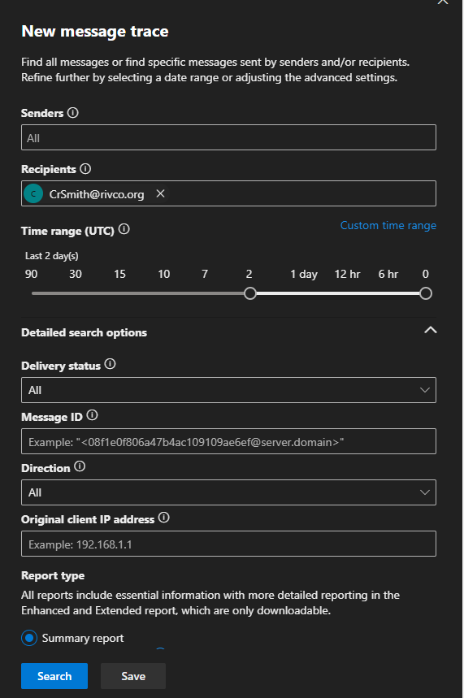

## **Introduction**

In regards to message tracing, there are essentially 3 places to check:

* [ProofPoint](https://003c2e01.pphosted.com:10001/admin) (anything inbound/outbound to or from external addresses)

* On-Prem mail servers (anything sent through SMTP, such as printers or intranet websites)

* [Exchange Online](https://admin.exchange.microsoft.com/#/messagetrace) (Inbound emails caught up in ProofPoint or Exchange On-Prem will not make it here)

### **ProofPoint** 

[ProofPoint](https://003c2e01.pphosted.com:10001/admin) can be used for searching email that has been sent in/out of the domain. This will return no results if searching for mailsend between two @rivco.org users. For a general outline of the mail process, refer to [mail flow in general information](/Exchange/#mail-flow)


In the image above, Smart Search has various fields to search for. The default is 24 hour search, however can be extended as needed. You can see under the `Final Action` column an emails status. Ideally `Continued` is the status, however other status descriptions such as `Quarantined; Discarded` may also apply


The above being an example of such a label. In this case, the email is in the users quarantine which can be released by the user once logging into [https://myspam.rivco.org:10020/euweb/login](https://myspam.rivco.org:10020/euweb/login)

???+ Example
    

    By expanding the `+` icon next to the `date` field, you can expand the details. This was flagged as `inbound_bulk` so was treated as spam, but can safely be allowed as a sender by the user. Additionally, the sender address isn't marked as a normal email. This traditionally occurs when the email blast is through an external SMTP of some sort.

### **On-Prem Exchange**

Remote to `RCIT-16EXCH01` or `RCIT-16EXCH02` and open `Exchange Management Shell` (or remote session through local shell to the server)

Once connected via the shell, you can run a `Get-MessageTrackingLog` command

???+ Example

    ```Powershell
    Get-MessageTrackingLog -server rcit-16exch02 -start "07/13/2023 12:00:00 PM" -Recipient Mpalma@rivco.org -ResultSize unlimited
    ```
    Depending on the mail route, it's always worth checking `rcit-16exch01` as well

    

### **Exchange Online**

Navigate to [Message trace](https://admin.exchange.microsoft.com/#/messagetrace) in the Exchange Online Admin portal and hit `+ Start Trace`



Enter useful search parameters here for query

???+ Note
    Any advanced search or basic query over 10 days will need to queue a report for later download and review. A basic query 10 days or left can be ran and viewed immediately

Common Status fields are `Delivered`, `Resolved` and `Failed`

* `Delivered` indicates that Exchange validates the message was successfully delivered. If the message indicates as such, but the email isn't in the inbox, it's best to check OWA or rules that a user may have to redirect this message elsewhere

* `Resolved`
    

    A `Resolved` status typically indicates it was sent to a secondary SMTP address (such as @rivcounty.mail.onmicrosoft.com) and was routed to the appropriate Exchange address

* `Failed` indicates the message failed for one reason or another. Typical reasons may include blocked sender/recipient, email doesn't exist, mail rules, etc. The senders NDR response mail should have more specific information on the reason for this email failing