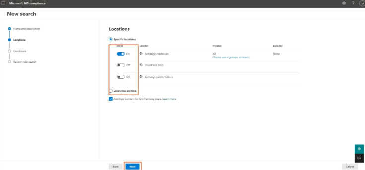
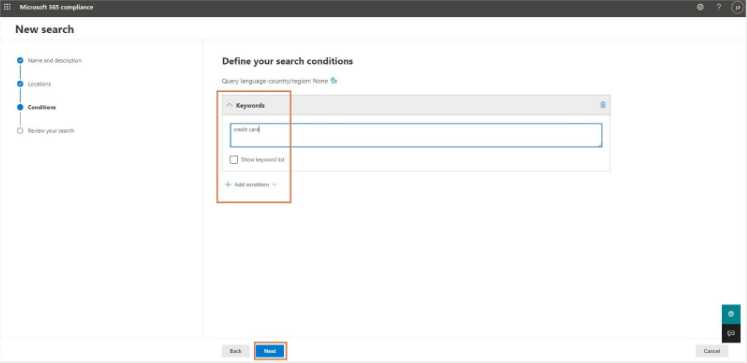
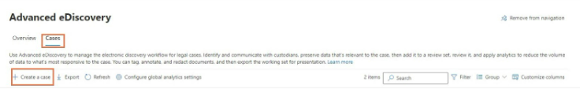

| | |
|:---:	|:---:	|
| **SUMMARY:** 	| Information regarding Litigation Hold/Public Records and eDiscovery 	|
| **DEPT or DIVISION AFFECTED:** 	| All County of Riverside (RCIT) supported computers 	|
| **EMPLOYEES RESPONSIBLE:** 	| All 	|
| **TOOLS / APPLICATIONS:** 	| Service Now, Exchange Online, Microsoft Purvue (Compliance) 	|

This document defines the process for dealing with eDiscovery in regard to Litigation Hold and Public Record requests. Please note, eDiscovery is not a backup solution and should NOT be used as one. 

## **Introduction**

This document defines the process for dealing with eDiscovery in regard to Litigation Hold and Public Record requests. Please note, eDiscovery is not a backup solution and should NOT be used as one. 

### **Core (Standard) eDiscovery - What is Microsoft 365 Core (Standard) eDiscovery?**

Microsoft Core (Standard) eDiscovery builds on the basic capabilities of the Content Search tool. Core (Standard) eDiscovery allows administrators and users with relevant permissions to create an eDiscovery case, search for content located in different Microsoft services, preview and export the search results, add managers to the case, place holds, etc. 

For RCIT, this is one of our tools for processing Litigation Hold requests for Riverside County. It is separate from its “Advanced Premium” version of the product, which is an additionally licensed item, covered later in this document. Either technology can be used to complete a Litigation Hold/Public Records request at the time of this writing. 

### **Core (Standard) eDiscovery - How to create a Core eDiscovery Case**

Step 1: Navigate to the Security and Compliance center.  

Step 2: Click “Core eDiscovery” under the “eDiscovery” drop-down on the navigation menu on the left-hand side of the screen.  

Step 3: Type a case name and a description (optional) and click “Save”  

Step 4: Select the case to navigate to the case page and take further action.  

 
### **Core (Standard) eDiscovery - How to run an eDiscovery search in a Core eDiscovery case?**

The eDiscovery Search tool can be used to search for content across Microsoft 365 data sources using keywords and conditions. The results of the search can then be exported to a local computer. 

Step 1: Navigate to the Security and Compliance center. Click “Core eDiscovery” under the eDiscovery drop-down on the navigation menu bar on the left-hand side of the screen.  

Step 2: Click “Searches'' from the top menu bar. Click “+New Search”.  

Step 3: Type a name and description (optional) for the new search. Click “Next”.  

Step 4: Choose the location to search for content.  
???+ Example
    Specific users, groups, or teams under Exchange mailboxes - Specific sites and OneDrive accounts or add the URL for a Microsoft Team, Office 365 Groups, etc., then click “Next”.  

Step 5: Add conditions for the search if needed. This could include specific keyword(s) and add conditions to search for the keyword. Click “Next”. 

Step 6: Review the search and click “Submit”. Once the content search run is complete, administrators can take further action like “Edit search,” “Rerun search,” etc. They can also export the search results as a .csv or a compressed .zip file by clicking “Export results”.  

### **Core (Standard) eDiscovery - How to create a hold in a Core eDiscovery case**

Step 1: Navigate to the Security and Compliance center  

Step 2: Click “Core eDiscovery” under the “eDiscovery” drop-down on the navigation menu on the left-hand side of the screen.  

Step 3: Create an eDiscovery case or open an existing case.  

Step 4: Click “Hold” on the top menu bar. Click “+Create”.  

Step 5: Enter a name for the hold and provide a description (optional). Click “Next”.  

Step 6: Choose the location (SharePoint sites, Exchange mailboxes or Exchange public folders). Click “Next”.Core eDiscovery hold  

Step 7: Enter the search query. Administrators can add a specific keyword and choose conditions to search for the query if needed  

Step 8: Review the settings and click “Submit”. The hold will be created based on the chosen location or the query and or condition.  

**It can take up to 24 hours for a hold to take effect.**

Once the hold is in place, it can be removed by an administrator whenever needed. When a hold is removed, a 30-day grace period is applied (called a delay hold) to prevent the content from being deleted.  

### **Microsoft 365 Advanced (Premium) eDiscovery – What is Advanced (Premium) eDiscovery?**

Microsoft Advanced (Premium) eDiscovery builds on the existing case management, preservation, search, and export functionalities of Core eDiscovery. With Advanced (Premium) eDiscovery, administrators can identify, collect, review, analyze, preserve, and export content relevant to any internal or external investigations. They can also collect data from any service, move it into review sets where they can add filters, search the content, tag and analyze it, and remove irrelevant content. from further review.  

Advanced (Premium) eDiscovery also helps manage custodians and legal hold notification workflows to communicate with custodians involved in any specific case. 

 
#### **Advanced eDiscovery Glossary:**  

**Custodian:** Custodians are users/people whose content an organization wants to specifically search for and gather as evidence ins any legal case.  

**Non-custodial data sources:** When a new collection is created, administrators can add non-custodial data sources. These could be sites or groups or any other sources that need to be included in the search.  

**Review sets:** In Advanced eDiscovery, data can be added to review sets where it can be reviewed, analyzed, tagged, and exported. 

**Collections:** Using collections, administrators can search for and collect live data from the Microsoft data sources. 
 
### **Microsoft 365 Advanced (Premium) eDiscovery – Electronic Discovery Reference Model (EDRM)**

EDRM or Electronic Discovery Reference Model is a framework that covers the standards for the process of discovering Electronically Stored Information.  

On a high level, the workflow of Advanced eDiscovery mimics that of the EDRM. Below is the Electronic Discovery Reference Model that presents a conceptual view of the eDiscovery process that can be replicated in an Advanced eDiscovery case.  

The Electronic Discovery Reference Model

A Typical Advanced eDiscovery Case Workflow 

### **Microsoft 365 Advanced (Premium) eDiscovery – How to create an Advanced eDiscovery case**

Step 1: Navigate to the security and compliance center.  

Step 2: Click “Advanced eDiscovery” under eDiscovery from the left-hand side menu bar.  

Step 3: Click “Cases” on the menu bar on the top and click “+ Create a case”.  

Step 4: Enter a case name, case number, and a description (optional). Administrators can further add members to configure the analytical settings related to the case and the format. Click "Save". 

 

### **Microsoft 365 Advanced (Premium) eDiscovery – How to create collections in an Advanced eDiscovery case**

A collection in Advanced eDiscovery is like a content search run in a Core eDiscovery case.  

To create a collection, follow the below steps:  

Step 1: Navigate to the security and compliance center and click “Advanced eDiscovery” under eDiscovery on the left-hand side menu bar.  

Step 2: Click “+ Create a case” or choose an existing case. Click “Collections” on the top menu bar and click “+ New collection”.  

Step 3: Enter the name and description (optional) of the collection, add custodians, non-custodial data sources, additional locations, conditions for the collection, save the collection as draft or add it directly to a review set. Admins can review the collections once the collection process is done.  

### **Microsoft 365 Advanced (Premium) eDiscovery - Access permissions requirements for end users** 

To access the features available within Microsoft eDiscovery a user needs appropriate permissions. These permissions can be assigned by the Compliance Administrator or the Global Administrator on the Security and Compliance center.  

Apart from the Compliance Administrator and the Global Administrator, users in the eDiscovery Manager and eDiscovery Administrator role group can perform eDiscovery related tasks.  

`eDiscovery manager` and `eDiscovery administrator` are sub-groups that fall under the eDiscovery manager compliance center role. Users can be added to these sub-groups by navigating to the eDiscovery manager group under the Permissions page.  

**eDiscovery Manager:** An eDiscovery manager can only manage the case that they create. They can create and manage Core and Advanced eDiscovery cases, create case holds, run searches, preview, and export search results, add and remove members, and access case data.  

**eDiscovery Administrator:** An eDiscovery administrator can perform all the tasks that the eDiscovery manager can. Additionally, an eDiscovery administrator can access all the Core and Advanced eDiscovery cases listed in the compliance center.  

The sub-groups can then be edited individually to add users to either of the roles by navigating to Compliance Center> Permissions> eDiscovery Manager> Edit role group. 

### **RCIT – eDiscovery Request Fulfillment Process – Service Now – Pre-requisites** 

**Pre-requisites for Request Submission**  

Generally, the RCIT Messaging Team will only process a Litigation Hold or Content Search request under the following circumstances:  

* Request MUST come though a Service Now Task – under the appropriate task category. This is officially shown in Service Now as a “Litigation Hold and Public Records Service Request”. Email requests will not be serviced.  

* Litigation Hold and Public Records Service Request must have appropriate information listed containing all required content search keywords (spelled correctly), full email accounts of both internal and external participants, and projected time frames. Additional information should still be provided if available.  

* Personal or Shared Inbox/Email communications regarding said above items will not be accepted, for potential legal concerns, and properly timestamped record keeping. All communications regarding an eDiscovery request should be done through the customer notes portion of the Service Now task.   

* Network location or Sharepath for delivery of data once exported.  

* Item not in compliance with the above standards will be closed if not updated with the needed information within 48 of our initial processing attempts. In the event a customer does not respond to a Service Now email requesting additional information after two business days, the ticket will be closed, and a re-submission will be required.  

### **RCIT – eDiscovery Request Fulfillment Process – Processing a Request**

If all items in  [RCIT – eDiscovery Request Fulfillment Process – Service Now – Pre-requisites](#rcit-ediscovery-request-fulfillment-process-service-now-pre-requisites) have been provided successfully, you will follow the steps from either of the following methodologies notated in previous pages of this document to begin the request: 

Note: Prior to proceeding, remember to notate any case created with the Service Now Task Number for reference

* [Core (Standard) eDiscovery - How to create a Core eDiscovery Case](#core-standard-ediscovery-how-to-create-a-core-ediscovery-case) and additional supporting documentation 

Or 

* [Microsoft 365 Advanced (Premium) eDiscovery – How to create an Advanced eDiscovery case](#microsoft-365-advanced-premium-ediscovery-how-to-create-an-advanced-ediscovery-case) and additional supporting documentation 

???+ Example

    

### **RCIT – eDiscovery Request Fulfillment Process – Exporting Discovered Content and Providing to User**

Content exported is provided in PST format, and depending on size of the search, may be broken into several PSTs as a result.   

Please refer to step 6 of [Core (Standard) eDiscovery - How to run an eDiscovery search](#core-standard-ediscovery-how-to-run-an-ediscovery-search-in-a-core-ediscovery-case) - for instructions on exporting.  

When exporting data for one of these requests, Messaging should also provide a report containing items pertaining to the search and criteria ran **(also shown in Step 6 above)** bundled with the results. Unless otherwise specified by Management, default options should be used, with “Enable de-duplication for Exchange Content” enabled. 

???+ Example

    

For initial content downloads – You can also use the Managed Services general purpose server for this function, as it has drive volume to accommodate larger export scenarios:  RCIT-19TSBP01 (10.19.142.161).  

It is currently recommended that any information provided to a customer be uploaded to a location only the requestors have access to, unless otherwise notated in Service Now by the submitter.  

### **RCIT – eDiscovery Request Fulfillment Process – Ticket and Case Closure**

After delivery of Case data to customer, the customer should be asked when we can close the Case and remove any hold on the mailbox. Upon agreeance on this, update Service Now with this information and close both the Service Now Ticket as completed and close the corresponding item in the Compliance Center.  

Further information to be added shortly  

### **RCIT – Licensing and Mailbox Information**

Regarding M365 Licensing and mailbox retention, some items to note are as follows:  

**Litigation Hold:** If a hold is place upon a mailbox, and the subsequent anchoring object is deleted from AAD, the mailbox will become what is known as an inactive mailbox. As such, it will be hidden from the address book. Please note, that if the mailbox exceeds 50GB in size, it will still require an Exchange License in this scenario.  

Further information will be added in coming weeks  