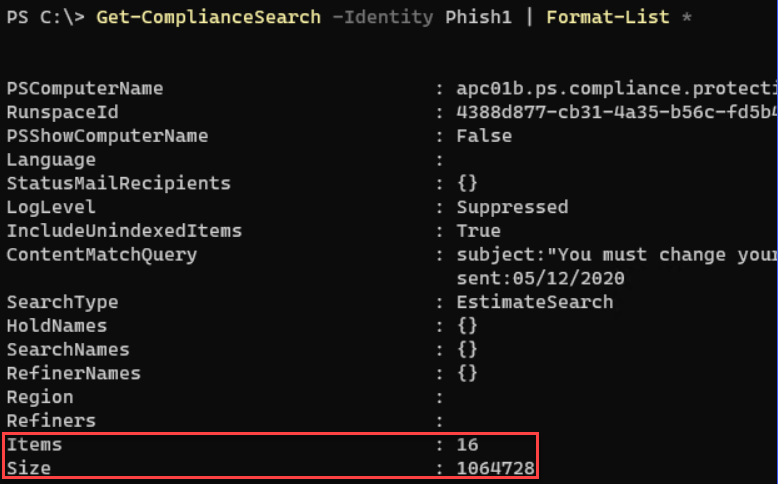
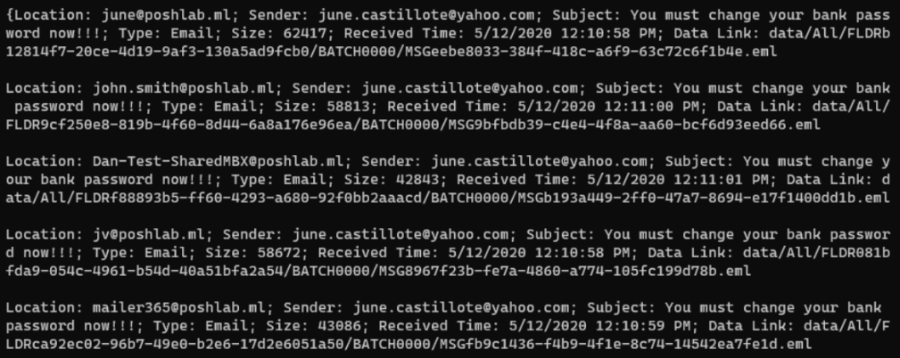

| | |
|:---:	|:---:	|
|       SUMMARY:  	|     Information regarding Messaging Team responsibilities and Email Removal Requests  	|
|     DEPT or DIVISION AFFECTED:  	|   All County of Riverside (RCIT) supported computers  	|
|     EMPLOYEES RESPONSIBLE:  	|   All  	|
|     TOOLS / APPLICATIONS:  	|   Service Now, Outlook, PowerShell, Microsoft Purview (Compliance), and Exchange Online  	|

## **Introduction**

The intent of this document is to provide information regarding the Messaging Team and its internal procedures for dealing with email removal requests. Further updates can and should be made to this document by additional members of the Messaging Team.  

### **General Information**

While not common, you will receive incident and/or task escalations which will require the Messaging Team to act by utilizing the mass removal email from mailboxes. This can occur from one of several (but not limited to) possible scenarios below:  

* Rivco Mailbox User accidentally sends out unintended mail to a large number of mailboxes internally.  

    * We will define “a large number of mailboxes” as <span style="color:red">100 or more recipients</span> as of the time this document was drafted.  

* Rivco Mailbox Users have mass received a malicious email which was not detected/quarantined by our security protocols (Proofpoint, etc.)  

* Requests from Management.  

### **Info - Email Removal Request - Services Messaging cannot provide**

* Messaging cannot remove mail cached on mobile/iOS devices.  

* Messaging cannot retrieve mail which has been sent to an external recipient  

### **Info - Email Removal Request – Admin Requirements**

* Permission required to search mailboxes and delete messages: The account must be a member of the eDiscovery Manager role group or be assigned the Compliance Search management role. 

* Permission required to delete messages: The account must be a member of the Organization Management role group or be assigned the Search and Purge management role 

* Permission required to preview messages: The account must be a member of the eDiscovery Manager role group or be assigned the Preview management role 

* <span style="color:red">PowerShell must be connected to the Office 365 Security & Compliance Center PowerShell. This requires you to import the ExchangeOnlineManagement module in PowerShell and open a connection with the compliance center (Purvue).</span>

```Powershell
Import-Module ExchangeOnlineManagement 
```
```Powershell
Connect-IPPSSession -UserPrincipalName "yourusername@contoso.com"
```

???+ Info
    Connect to Security & Compliance PowerShell: [Connect to Security & Compliance PowerShell](https://learn.microsoft.com/en-us/powershell/exchange/connect-to-scc-powershell?view=exchange-ps)

### **Info - Email Removal Request – Ticket Information Requirement (INC)**

Once an email removal request has been received, you will want to gather as much data as possible about the message that needs to be deleted. Without obtaining precise data and search criteria, <span style="color:red">you will run the risk of potentially creating a query which may result in unintentionally deleting unintended email.  </span>

<span style="text-decoration:underline">**Critical information required prior to processing a request**</span>

* <span style="color:red">What is the sender’s email address? (Required) </span>

* <span style="color:red">What is the message subject? (Required) </span>

* Are there file attachments, and what are the filenames?

* What’s the date of the first reported occurrence? 

* Who are the recipients? 

Items listed above in <span style="color:red">red</span> are requirements. Requests lacking this information will be rejected and sent back to the escalating individual or submitter.  

### **Email Removal Request – Create Content Search**

There are multiple ways to create a content search, both via PowerShell and through the Compliance portal (Compliance.microsoft.com). This document will cover only the PowerShell aspect of this task, as removal actions after creating a content search are not present in the Compliance Portal, which require PowerShell to complete. 

<span style="text-decoration:underline">**Example Request:**</span>  

*Remove email with the following criteria*

<span style="color:red">**Subject:** You must change your bank password now</span>

<span style="color:red">**Sent:** 05/12/2020</span>

Using the `New-ComplianceSearch` cmdlet in PowerShell, the message properties listed above will be used to create a search query. The key to keeping the search results as accurate as possible depends on the adequately formulated search criteria.  

???+ Example 
    This creates a compliance search with the -Name provided being the name of the search for further interactions. `ContentMatchQuery` is the input for search parameters. 

    ```Powershell
    New-ComplianceSearch -Name Phish1 -ExchangeLocation All -ContentMatchQuery 'subject:"You must change your bank password now" AND sent:05/12/2020' 
    ``` 
    This creates the search; however, it does not start it. To start the search continuing with the above example, you would use the following command supplied with the `-Name` you gave the search: 

    ```Powershell
    Start-ComplianceSearch -Identity Phish1
    ```
    After starting this search, this may take several minutes to the upwards of an hour to complete. To check the status of this search, running the following will give you a status: 
    
    ```Powershell
    Get-ComplianceSearch -Identity Phish1 
    ```
    
    If **“Status”** does not equal **“Complete”**, you will need to wait for this process to finish before proceeding.  

    If you would like to check the number of items indexed through the Content Search, one way to obtain this (but not limited to) would be as follows:  
    
    ```Powershell
    Get-ComplianceSearch -Identity Phish1 | Format-List * 
    ```
    

### **Email Removal Request – Previewing Search Results**

Prior to email deletion, you should review the result of your search. To preview the search results, you now need to create a preview action using the command below. 

```Powershell
New-ComplianceSearchAction -SearchName Phish1 -Preview 
``` 

This will start processing a job like we did prior in the [Email Removal Request – Create Content Search](#email-removal-request-create-content-search) step. This will also take the name you gave the search and append an `_Preview` to its name.  

Example: `Phish1_Preview`  

Once these results have completed. You can then run the following command to get the output of the results:  

```Powershell
(Get-ComplianceSearchAction Phish1_Preview | Select-Object -ExpandProperty Results) -split ","  
```


*Note: This report can also be exported from the Compliance Center as a secondary option* 
 
### **Email Removal Request – Delete email from inboxes**

To delete the messages that matched the search criteria, you need to create a purge job using the `New-ComplianceSearchAction` cmdlet with the `-Purge` switch and `-PurgeType` parameter. 

*<span style="color:red">Important:</span> `-PurgeType` parameter `SoftDelete` will move all mail into the effected mailboxes recovery inbox. This also means that a user may be able to recover this email if they go into the recovery folder and restore.* 

<span style="color:red">For permanent deletion</span> use parameter `HardDelete`  

<span style="color:red">Additionally, unlike `New-ComplianceSearch` once you run this command, the job will automatically start. Once run, you will be unable to recover email (if needed) if using the `HardDelete` parameter. Proceed with caution.</span>

???+ Example
    ```Powershell
    New-ComplianceSearchAction -SearchName Phish1 -Purge -PurgeType SoftDelete 
    ```
    
    Like preceding items, this will create a purge job, affixed with the tag `_Purge`. This can be used to view the final result. 

 
???+ Example
    ```Powershell
    Get-ComplianceSearchAction -Identity Phish1_Purge | Format-List
    ``` 
    

### **Email Removal Request – Service Now Ticket Closure Requirements**

After completion of an Email Removal Request. We need to place resolution data in the submitted Service Now ticket. This would include compliance search query, and its final result after completing steps in [Email Removal Request – Delete email from inboxes](#email-removal-request-delete-email-from-inboxes).  

Until this is further improved upon, the recommendation is that we attach the following to each completed request: 

* The report query which shows the compliance search parameters and discovered items – This can be done in one of several ways: PowerShell Export or a CSV Export from the Compliance Center using the case name. If opting for PowerShell, please follow the native export formatting from the Compliance Center to keep items consistent. 

* An export of the `Get-ComplianceSearchAction` cmdlet, attached or pasted into the work notes. 
```Powershell
Get-ComplianceSearchAction -Identity Phish1_Purge | Format-List 
```

The reason for this, is that in the event of any questions or audits on why we have completed a request of this nature, it allows for Service Now to be the center point of determining why something was completed. Additionally, in the event a request is made that is later found to be a mistake, we have evidence of why said request was completed and documented in a central location.  