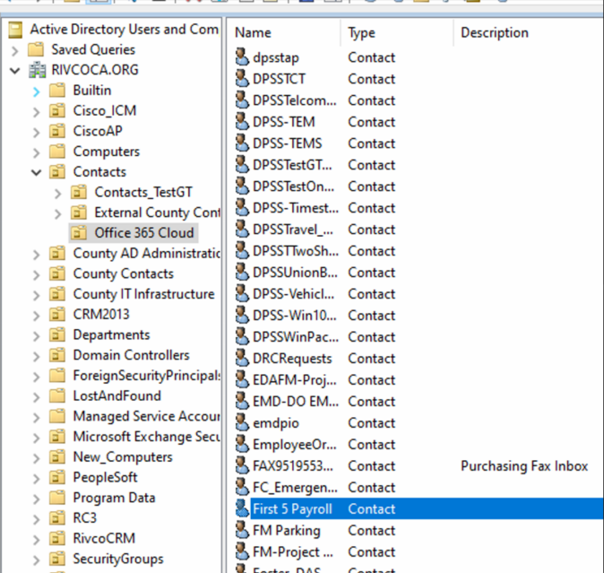
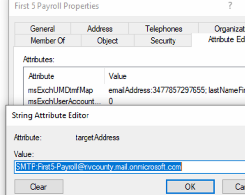
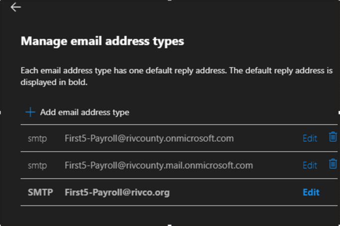

## SMTP to SharedMailboxes

If a SharedMailbox desires to send SMTP email through the On-Prem exchange server, we need to set up routing information for the mailbox. To do so, we can start by going to the Exchange Server `RCIT-16EXCH01` or `RCIT-16EXCH02` and creating a mailcontact.  

Once logged in, open IE/Edge browser and navigate to `http://mail.rivcoca.org/ecp` > login > contacts tab  

From here, hit the `+` icon and select `Mail Contact`  

Fill out the contact as it matches to the Exchange Online mailbox attributes. Prior to creating, ensure the Oranizational Unit is selected as `RIVCOCA.ORG/Contacts/Office 365 Cloud`  

Once created, switch to ADUC and locate the contact you've created

Open the contact (ensure advanced features are enabled so you can edit the attributes)

Append the proxy so that `@rivco.org` is the primary, with `@rivcounty.mail.onmicrosoft.com` as a secondary

Then change the `targetAddress` attribute to point to `@rivcounty.mail.onmicrosoft.com`  

Now go to the Exchange Online Admin portal and search the Shared Mailbox and select `Manage Email Address types` under the general tab

Now append the primary/secondary attributes so it should have at least these 3 values

The primary (all caps SMTP) must be the @rivco.org variant, with secondary the on-prem value. Wait 20-30 minutes to allow syncs to propagate and attempt SMTP email.