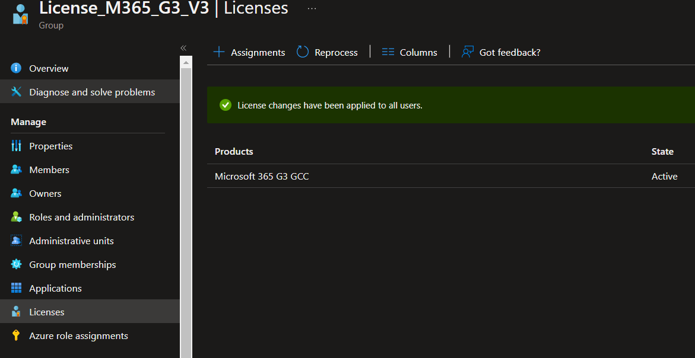

## Group Based Licensing

In general, we do not direct assign licensing and opt for Group Based. 

```
License_M365_G3_V3
```

Above is an example of one of these groups. This is a "Direct" assigned group that currently applies 20 of 25 sku's in the O365 license. Assigning someone to this group will apply the associated sku's and additional dynamic groups may apply from there, if conditions are met



Additional groups, mostly dynamic, are also present all under the `License_` prefix in Azure.

### **Dynamic Licensing**

Some groups are Dynamic, in that they're applied based on accordance of certain conditions being met. Win10 and Audio Conferencing licensing is done this route, for example. Once the above `License_M365_G3_V3` is applied, Azure will dynamically apply other licensing.


Above is an example of DPSS Stream licensing. Certain conditions are set to allow, once met, licensing to apply accordingly. The filters can be set through Azures GUI, however the filters applied (also on the dynamic tab of the groups blade in Azure) and appear as below:

```
(user.department -eq "DPSS") and (user.accountEnabled -eq true) and (user.employeeId -ne null) and (user.assignedPlans -any (assignedPlan.serviceplanid -eq "8c3069c0-ccdb-44be-ab77-986203a67df2" -and assignedPlan.capabilityStatus -eq "Enabled"))
```

As can be seen, once Department, accountenabled, EID and active O365 license are checked, this group will automatically apply. A common issue here is the `employeeId` attribute. As we source our Azure employee data from on-prem Active Directory, Azure employee data is only as good as its source. There are two employee # related attributes in Active Directory. `EmployeeNumber` and `employeeId`. `EmployeeNumber` is a modifable field, however `employeeId` is synced from PeopleSoft data. If this attribute is null/empty, there's two potential issues:   

1.) The `employeeId` is not yet in PeopleSoft, so has not synced down  
2.) The `employeeId` value is taken by a different account. PeopleSoft cannot sync the attribute down to the new account if this attribute is synced to another account. This attribute must be unique. Deleting/resolving the issue with the other account will cause this attribute to populate on next sync and resolve the issue.