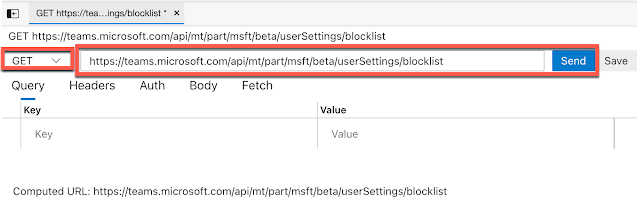

- Open the Teams web client through Microsoft Edge browser and sign in with an affected user account.

- Open Web Developer tools with the keyboard shortcut `Ctrl+Shift+I` or `F12`, and select the "Network" tab.

- Switch to the Teams UI on the left side of the Edge browser and click on the "3-dot menu" next to the profile picture. Select the "Settings" option.

- Selecting the "Settings" option will display the "Settings page" on the Teams UI, and the Web Developer tools network tab will show multiple events.

- Search for the "blocklist" event.

- Right-click on the "blocklist" event and select "Edit and Resend."


- In the API URLs section, select the GET method and type the following URL: `https://teams.microsoft.com/api/mt/part/msft/beta/userSettings/blocklist`, and click "Send."



- You will find all the blocked contacts, including PSTN numbers. Grab this GUID for later use

- Change the API method to "POST" and change the URL to `https://teams.microsoft.com/api/mt/part/msft/beta/userSettings/blocklist/manage`.


- Switch from the "Query" tab to the "Body" tab to modify the body.

- Paste the following value into the "Body" field (ensure to edit this with the previous GET GUID):

```json
{"remove":["8:orgid:Enter the User GUID you found on the GET result"]}
```

- Click "Send."