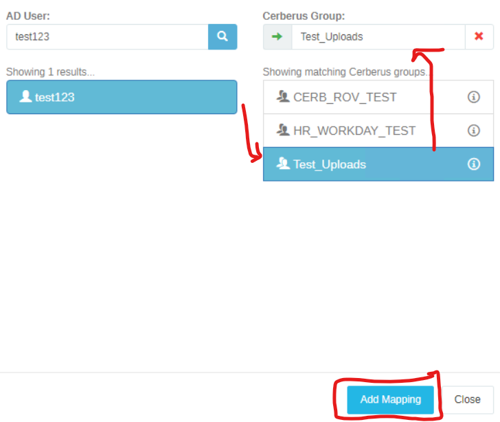

# RCIT-16SFTP01
This is the counties main FTP server as of ***8-15-23***.
> https://ftp.co.riverside.ca.us/login

## ACCESS
✅ [VMWare Aria Automation](https://console.cloud.vmware.com/csp/gateway/discovery)

✅ RDP (ZRCIT-16SFTP01.tzone.lcl) | 172.30.20.224

---
# RCIT-16SFTP02
This is the counties main backup FTP server as of ***8-15-23***.
> https://ftp.co.riverside.ca.us/login

## ACCESS
✅ [VMWare Aria Automation](https://console.cloud.vmware.com/csp/gateway/discovery)

✅ RDP (ZRCIT-16SFTP02.tzone.lcl) | 172.30.20.225

### Note
In most cases, adding FTP users is a straightforward process that involves:

- Adding the user to TZONE AD

- Adding the user to the relevant AD Group (this group should be specified in the task, and often includes instructions to copy permissions from an existing user)

- Send user temp login details with the following: [Self-Service How to Enroll](./docs/SelfService_HowToEnroll-RCIT.pdf) and [Web Client Users Guide](./docs/Web-Client-Users-Guide.pdf).

## Create Cerberus FTP Group
- Navigate to Authentication -> User Manager -> Groups

- Folder should be created under F:/FTPROOT/...

## Map AD Users to Cerberus FTP Group
- Navigate to Authentication -> AD Users -> User & Group Custom Mappings -> New

- Find user, Select Group, Add Mapping
